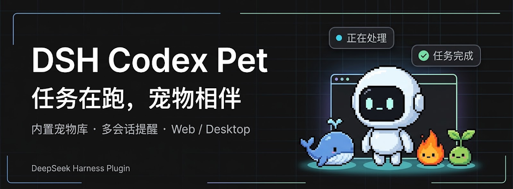
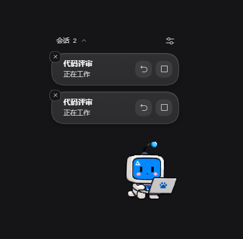
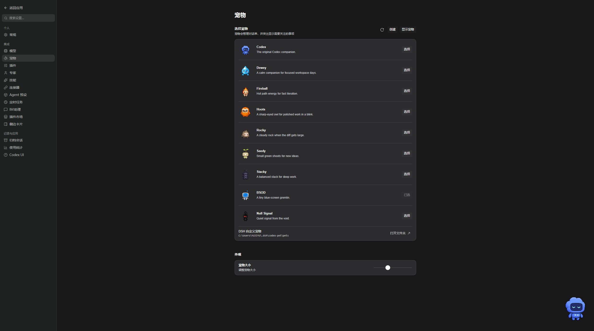
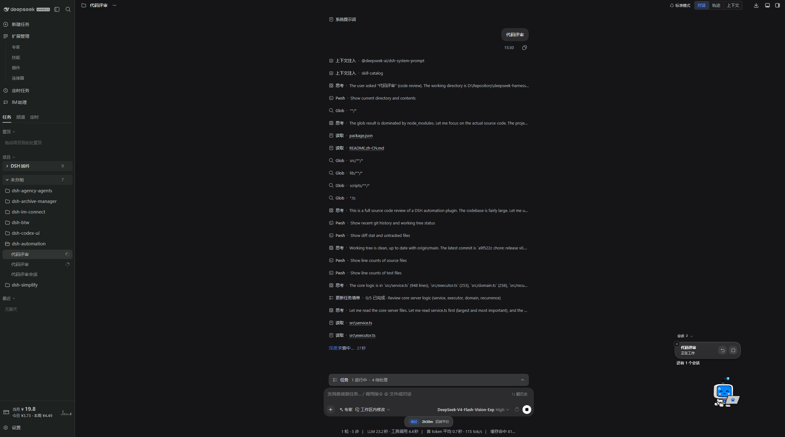

<p align="center">
  
</p>

<div align="center">

# DSH Codex Pet

**任务在跑，宠物相伴。让 DeepSeek Harness 的任务进展触手可及。**

[English](README.md) · [界面预览](#界面预览) · [功能概览](#功能概览) · [安装](#安装) · [使用](#使用) · [开发](#开发) · [更新日志](CHANGELOG.zh-CN.md)

[](https://github.com/deepseek-ai/deepseek-harness)
[](https://nodejs.org/)
[](#验证与当前边界)

</div>

DSH Codex Pet 为 [DeepSeek Harness](https://github.com/deepseek-ai/deepseek-harness) 提供宠物库、任务通知和基于 Skill 的宠物创建功能。全部 9 只 Codex 内置宠物图集随插件提供，使用人员无需安装 Codex。

## 功能概览

- **9 只内置宠物**：在宠物设置中选择伙伴、调整大小，资源随插件本地打包。
- **页内陪伴**：插件在 DSH Web 页面内显示宠物，并提供消费者接口；外部宿主自行适配窗口与 IPC。
- **多会话动态**：查看运行中、完成、错误和待处理请求；没有通知时只显示宠物。
- **就近处理任务**：从通知打开对应会话、停止当前轮次，或处理支持的审批、问题和计划请求。
- **按需安静**：关闭单条提醒不会停止任务；通过菜单或设置收起、恢复宠物。
- **创建自己的伙伴**：在设置中描述宠物，通过随包 `hatch-pet` Skill 发起独立 DSH 创建任务。
- **轻量互动**：拖动移动、双击跳跃、右键打开宠物菜单。

## 界面预览

### 多会话提醒

宠物旁集中展示运行中的任务，可分别打开会话、停止当前轮次或关闭提醒。

<p align="center">
  
</p>

### 宠物设置

选择 9 只内置宠物、打开自定义宠物目录，并调整宠物大小。



### 会话内陪伴

在 DSH 中继续工作，宠物和任务通知显示在页面角落。



## DSH 产品生态

为已有 DeepSeek Harness 环境按需安装插件；外部消费者可独立接入宠物接口。

| 插件 | 你可以用它做什么 |
| --- | --- |
| [Codex UI](https://github.com/MichengAI/dsh-codex-ui) | 整理项目与会话，导航任务 |
| [IM Connect](https://github.com/MichengAI/dsh-im-connect) | 从消息平台下任务、收回复 |
| [Automation](https://github.com/MichengAI/dsh-automation) | 按计划执行任务，查看运行结果 |
| [Skills Manager](https://github.com/MichengAI/dsh-skills-manager) | 查找、启停、创建和导入本机技能 |
| [Archive Manager](https://github.com/MichengAI/dsh-archive-manager) | 搜索、恢复和管理已归档会话 |
| [Agency Agents](https://github.com/MichengAI/dsh-agency-agents) | 为任务选择专业角色 |
| [BTW](https://github.com/MichengAI/dsh-btw) | 在当前上下文中临时旁问 |
| [Simplify](https://github.com/MichengAI/dsh-simplify) | 整理 Git 改动范围内的代码 |
| [Codex Pet](https://github.com/MichengAI/dsh-codex-pet) | 宠物陪伴，查看和处理任务通知 |

## 前置条件

- 已安装 DeepSeek Harness，可使用 Web 界面和 `dsh` 命令。
- 从源码构建需要 **Node.js 22.19 或更高版本**。
- 创建自定义宠物需要在 DSH 中配置可用的图像生成工具。

## 安装

兼容要求：宿主必须提供 `locale` 客户端服务，并支持函数形式的 `settings.section` 标签。本地契约核验使用 `@deepseek-ai/cordis 4.0.2`、`@deepseek-ai/dsh-client-locale 0.1.2-rc.1` 及社区 DSH Codex UI 设置实现。这些是已核验组件版本，不代表已经验证的最低 DSH 版本；不支持缺少 locale 服务的宿主。

自动更新命令使用 `--config.minimumReleaseAge=0`，以便立即安装刚发布的版本；该参数仅对本次安装跳过 pnpm 的发布时间等待，不改写全局配置。包名、npm registry 和解析后的版本仍由服务端固定。

v0.1.1 安装包包含本文描述的设置、本地化、npm 更新器和消费者接口改动，详见[更新日志](CHANGELOG.zh-CN.md)。

当前为 **0.1.1 开发预览版**，通过 [GitHub Releases](https://github.com/MichengAI/dsh-codex-pet/releases/tag/v0.1.1) 分发。尚未发布 npm 包。以下命令使用 `web` profile，请按实际环境替换。

从 Release 下载 `michengai-dsh-codex-pet-0.1.1.tgz`，在下载目录执行 `dsh plugin --profile web add .\michengai-dsh-codex-pet-0.1.1.tgz --ignore-scripts`，然后重新加载 DSH。也可按下面的步骤从源码构建。

### 让 Agent 帮你安装

```text
请从我的本地源码目录将 DSH Codex Pet 安装到 DSH 的 web profile。在源码目录依次执行 npm ci、npm run check、npm test 和 npm pack。检查通过后，执行 dsh plugin --profile web add .\michengai-dsh-codex-pet-0.1.1.tgz --ignore-scripts 安装生成的包，再执行 dsh --profile web --dump-config，确认包含 michengai-codex-pet。说明如何重新加载 DSH 并打开宠物设置，保留已有任务和用户数据。
```

### 手动构建并安装

在项目根目录执行：

```powershell
[Console]::OutputEncoding = [System.Text.Encoding]::UTF8
$OutputEncoding = [System.Text.Encoding]::UTF8

npm ci
npm run check
npm test
npm pack
dsh plugin --profile web add .\michengai-dsh-codex-pet-0.1.1.tgz --ignore-scripts
dsh --profile web --dump-config
```

任一步骤失败时先停止并解决错误。`npm pack` 会构建插件并检查 9 只图集和创建 Skill，生成的安装包包含运行所需资源。

### 重新加载

等待正在执行的任务结束后，重启对应 DSH Web 服务并刷新页面。仅刷新浏览器不能替换已经加载的 Host 模块。

## 使用

打开 **设置 → 宠物**，也可从宠物右键菜单打开设置。

| 目标 | 操作 |
| --- | --- |
| 选择伙伴 | 在设置中选择宠物并调整大小。 |
| 移动与互动 | 拖动宠物移动，双击跳跃。 |
| 查看任务动态 | 阅读通知气泡；多个任务需要关注时展开列表。 |
| 继续会话 | 点击通知或回复按钮，打开对应的 DSH 任务。 |
| 处理请求 | 展开请求详情，处理支持的审批、问题或计划。 |
| 停止任务轮次 | 点击对应运行中通知的停止按钮。 |
| 关闭提醒 | 点击通知关闭按钮，任务仍继续运行。 |
| 收起或恢复宠物 | 使用右键菜单或宠物设置。 |

宠物承担通知和待处理操作。新建会话、输入后续消息仍在 DSH 主界面完成。

### 创建自定义宠物

1. 打开宠物设置，点击 **创建**，描述想要的伙伴。
2. 点击 **在 DSH 中创建**，插件会打开独立任务并发送随包 Skill 指令。
3. 在该任务中查看进展，创建使用 DSH 当前配置的模型和图像工具。
4. 宠物文件生成并保存后，刷新宠物库并选择新伙伴。

随包 `skills/hatch-pet/SKILL.md` 已针对 DSH 和兼容图集格式适配，创建流程不调用 Codex CLI。缺少生图工具时需要先完善 DSH 配置；成功打开创建任务不等于宠物已经生成。

## 数据与资源

- 内置图集：`assets/codex/`，随插件提供。
- 自定义宠物：`${DSH_HOME}\codex-pet\pets`；未设置 `DSH_HOME` 时，以用户目录下的 `.dsh` 为基础目录。
- 不自动读取、移动或迁移原有 Codex 宠物。
- 卸载插件会保留自定义宠物文件和配置。

插件代码独立实现、由社区维护。随包 Codex 宠物图集来源于 Codex，并非本项目原创素材。本项目不是 OpenAI 或 DeepSeek 官方产品。

## 插件更新

宠物设置页显示当前运行版本、GitHub 和问题反馈链接，以及**检查更新**入口。更新器查询 npm，通过已验证的 DSH CLI 安装到当前 profile；npm 尚未发布时会明确提示。宿主不支持在线安装时，可复制手动更新命令。请等待任务结束后更新，并按提示重新加载 DSH。

## 卸载

```powershell
[Console]::OutputEncoding = [System.Text.Encoding]::UTF8
$OutputEncoding = [System.Text.Encoding]::UTF8

dsh plugin --profile web remove @michengai/dsh-codex-pet
```

完成后重新加载 DSH。切换版本时保留 DSH 数据目录。

## 开发

```powershell
[Console]::OutputEncoding = [System.Text.Encoding]::UTF8
$OutputEncoding = [System.Text.Encoding]::UTF8

npm ci
npm run check
npm test
npm run build
```

- `src/`：Host 服务、宠物设置、动画和任务通知。
- `skills/`：随包宠物创建 Skill。
- `test/`：宠物库、创建和通知回归测试。
- `scripts/`：构建、资源维护、安装包校验和隔离 Electron smoke 检查。
- `lib/`：生成的运行产物，修改源码应在 `src/` 中进行。

项目不提供独立 HTML 预览页或原生窗口入口，请在 DSH 内验证。`assets:import` 仅供维护者更新原始资源，使用者安装时无需执行。

使用 CodeGraph 时，首次运行 `codegraph init .`，修改后运行 `codegraph sync .`，通过 `codegraph status .` 检查索引新鲜度。索引与 `docs/` 下的本地项目文档均不纳入 Git。

## 验证与当前边界

类型检查、25 项自动化测试、构建和受控浏览器客户端交互验证已通过，覆盖任务通知和创建请求流程。完整图像生成、真实模型任务联动及真实 npm 更新仍待端到端验收。


## 浏览器冒烟测试

执行 `npm ci` 后，运行 `npx playwright install chromium`，再执行 `npm run smoke`。Playwright 是本项目的开发依赖，测试使用无头 Chromium 和独立系统临时目录，测试进程退出后自动清理；不需要 Electron、相邻仓库、`.preview` 或 docs 输出。

## 消费者接口 v1

插件在 DSH 页面提供 `window.dshPet`，发布 `dsh-pet-ready` / `dsh-pet-disposed` 事件。消费者主动订阅和展示，插件不导入或探测消费者。旧原生窗口路由与窗口桥接已移除，已有原生适配需迁移到此接口。

| 方法 | 约定 |
| --- | --- |
| `getSnapshot()` | 返回独立副本 `{pet, config, language, notifications}`；未加载或卸载后为 `null`。宠物资源相对 URL 按 DSH 页面 origin 解析。 |
| `subscribe(listener)` | 内容变化时通知，卸载时收到 `null`；返回退订函数。初始状态另行调用 getSnapshot。 |
| `command(value)` | 执行通知操作：open、stop、dismiss、restore、approve、reject、answer、sort。目标操作携带当前通知 id、token；请求回答另带 requestKey。校验和拒绝由插件执行。 |
| `updateConfig(value)` | 通过现有 Host 校验接口更新宠物设置。 |
| `openSettings()` | 在 DSH 打开宠物设置。 |
| `acquireDisplay()` | 暂时隐藏页内浮层，返回幂等释放函数。消费者断开时必须释放，所有接管者释放后恢复页内显示，不改持久化可见性配置。 |

消费者负责自身渲染器、原生窗口、IPC 校验和断开清理；接口不携带原生窗口实现。用户标题、问题与回答选项保持原文，language 字段提供显示语言。
